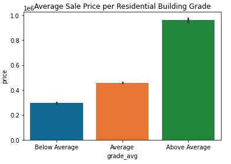

# King County Housing Sale Price Analysis

**Author**: Dan Lee

## Business Problem

A prominent YouTuber has hired us because she is planning to produce a series of videos on house flipping. The process of flipping property is essentially purchasing some real estate, investing in it through construction or additions, and selling for a profit. Our client wants to know what features most determine home sale price, so she can give her viewers a guide on how to best invest in the properties they purchase/sell.

## Data Understanding

The dataset we are analyzing contains information about real estate in King County. This includes 21,597 entries spanning May 2014 - May 2015. We will use this data to create a multiple linear regression model in order to discover two features that affect home sale price.

## Data Preparation

In order to ensure clean data, we will explore the dataset for outliers, missing values, and multicollinearity.

## Modeling
Here are the strategies we will attempt as we fine tune our baseline linear regression model:
1. Remove features based on coefficient values
2. One hot encode categorical data
3. Check for substantial interaction relationships between features

## Results

### Square foot living space increases sale price average


### Residential building grade increases sale price average


### Relationship between living space and grade and its effects on sale price


### Waterfront views increase sale price


## Evaluation
After multiple iterations on our model, the resulting findings are:
1. Square Foot Living Space & Residential Building Grade have the strongest relationship with home sale price
2. Waterfront view has a moderate affect on sale price, and is a worthy factor to consider

### Recommendations
A house flipper will want to keep the following in mind when allocating their resources towards home improvement:
1. Increase living area square footage - Renovate basement and attic spaces. Add extensions to the home. Build additional living space above the garage
2. Focus on quality of materials and finishes during construction - This includes kitchen countertops, floors, cabinetry design, lighting fixtures, luxury features
3. Keep an eye out for homes with a waterfront view

## Repository Structure

```
├── README.md     
<- The top-level README for reviewers of this project
├── HousingAnalysis.ipynb   
<- Narrative documentation of analysis in Jupyter notebook
├── HousingAnalysis.pdf
<- PDF version of Jupyter notebook
├── Non Tec Presentation - House Flipping Kings.pdf        
<- PDF version of project presentation
├── data                                
<- Both sourced externally and generated from code
└── images                              
<- Both sourced externally and generated from code
```
≈